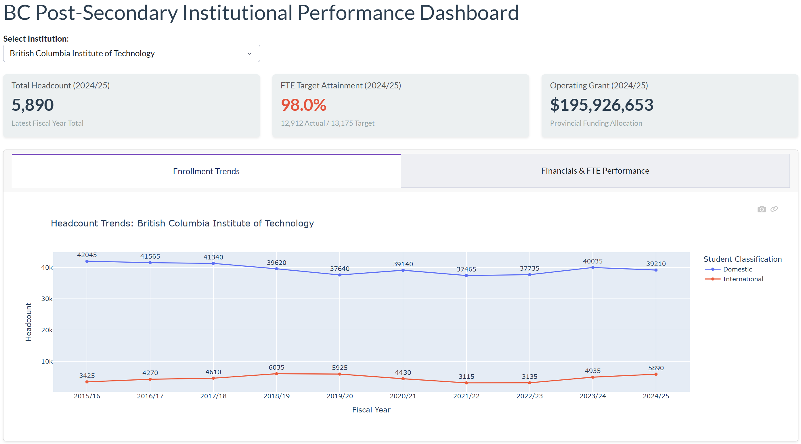
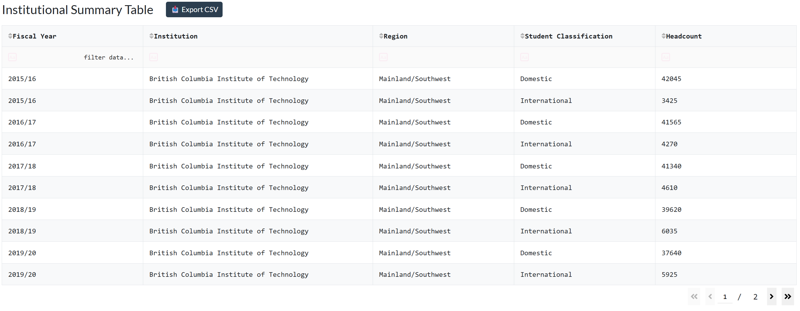

# BC Post-Secondary Institutional Performance Dashboard

A containerized, interactive web application built with **Dash**, **Plotly**, and **Bootstrap**, designed to visualize enrollment trends, FTE target attainment rates, and operating grant allocations across British Columbia post-secondary institutions.

The application uses **SQLite** for analytical data storage, runs on a **Gunicorn** WSGI production server, and features automated testing via **GitHub Actions** with continuous deployment on **Render**.

---

## 🔗 Live Application

The application is deployed live on Render and automatically updates whenever changes are merged into the `main` branch:

- **Live URL:** [https://three-institutional-performance-dashboard.onrender.com/](https://three-institutional-performance-dashboard.onrender.com/)
- **Hosting Platform:** Render (Docker Web Service)
- **Status:** Active & Monitored

<p align="center">
  
</p>

### Interactive Data Table

<p align="center">
  
</p>

---

## Tech Stack & Architecture

- **Frontend & Visualizations:** Dash, Plotly Express, Dash Bootstrap Components (`FLATLY` theme)
- **Backend & Server:** Python 3.12, Flask, Gunicorn WSGI
- **Data Engine:** SQLite (Read-Only), Pandas
- **Containerization:** Docker
- **Continuous Integration (CI):** GitHub Actions (`pytest` automated test suite)
- **Cloud Hosting:** Render PaaS (Auto-deploys from `main` branch with TLS/SSL termination)

---

## Project Structure

```text
3-institutional-performance-dashboard/
├── .github/
│   └── workflows/
│       └── ci.yml              # GitHub Actions CI workflow 
├── docs/
│   └── assets/
│       └── dashboard_preview.png
config
├── app/
│   ├── __init__.py
│   ├── app.py                  # Main Dash layout & interactive callbacks
│   └── data_loader.py          # SQLite database connection & query functions
├── data/
│   └── raw/
│       └── enrollment.db       # Relational SQLite database
├── tests/
│   ├── __init__.py
│   └── test_app.py             # Pytest suite for queries & callbacks
├── Dockerfile                  # Container build instructions for Gunicorn
├── requirements.txt            # Python dependencies
├── README.md                   # Project documentation
└── .gitignore
```

---

## Local Development Setup

### Option 1: Standard Python Environment (Direct Execution)

**1. Clone the repository:**

```powershell
git clone https://github.com/kellycheung5-collab/3-institutional-performance-dashboard.git
cd 3-institutional-performance-dashboard
```

**2. Create and activate a virtual environment:**

```powershell
python -m venv venv
.\venv\Scripts\Activate.ps1
```

**3. Install dependencies:**

```powershell
pip install -r requirements.txt
```

**4. Run the application locally:**

```powershell
python app/app.py
```

Access the dashboard at [http://127.0.0.1:8050/](http://127.0.0.1:8050/).

### Option 2: Local Docker Container (Without Nginx)

**1. Build the Docker image:**

```powershell
docker build -t bc-performance-dashboard .
```

**2. Run the container:**

```powershell
docker run -d -p 10000:10000 --name bc-dashboard-standalone bc-performance-dashboard
```

Access the dashboard at [http://localhost:10000/](http://localhost:10000/).

### Option 3: Local Docker Container (Without Nginx Reverse Proxy)

**1. Build the Docker image:**

Test the production-like multi-container setup where Nginx listens on standard HTTP port 80 and proxies traffic to Gunicorn listening on port 10000.


```powershell
docker-compose up -d --build
```

**2. Verify container status:**

```powershell
docker-compose ps
```

Access the dashboard at [http://localhost/](http://localhost/).

**3. Stop the stack:**

```powershell
docker-compose down
```

---

## Automated Testing

Unit tests validate data ingestion schemas, database joins, and callback layout structure using `pytest`.

**To run tests locally:**

```powershell
pip install pytest
python -m pytest
```

### Continuous Integration Pipeline

Every push or pull request targeting `main` automatically triggers the GitHub Actions CI pipeline, which:

1. Provisions an `ubuntu-latest` runner with Python 3.12.
2. Installs required application packages.
3. Sets `PYTHONPATH=.` and executes `python -m pytest`.

---

## Environment Variables

The application enforces secure fallback checks for production environments (`FLASK_ENV=production`).

| Key | Description | Local Default | Production Requirement |
|---|---|---|---|
| `SECRET_KEY` | Flask session & security key | `default-fallback-key` | Must be configured with a strong hex string |
| `FLASK_ENV` | Environment context | `development` | Set to `production` |
| `DASH_DEBUG` | Dash interactive debugger toggle | `False` | Set to `False` |
| `PORT` | Web server listening port | 10000 | Dynamically injected by Render |

---

## Cloud Deployment Details (Render)

- **Runtime:** Docker
- **Server Command:** `gunicorn --bind 0.0.0.0:${PORT:-10000}`
- **Build Trigger:** Automatic deployment upon successful push/merge to `main`.
- **SSL/TLS:** Managed automatically by Render.
- **Data Persistence:** Read-only SQLite database bundled directly within the built Docker image.